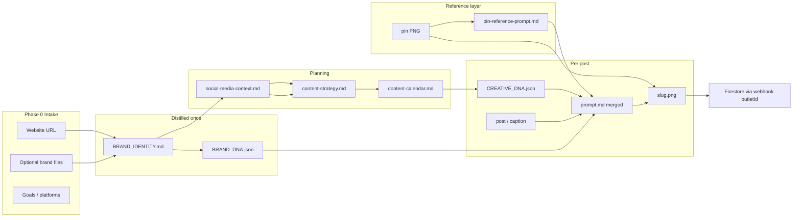

# How the Brand → Social → Creative Pipeline Works

Human-readable overview of [`skills/brand-social-creative-pipeline/SKILL.md`](../skills/brand-social-creative-pipeline/SKILL.md).

**Canonical client examples:** `clients/swayam/`, `clients/eduhexa/`, `clients/hexanovate/`

---

## What it does

One ordered workflow: take a brand (website + optional files) and produce **social strategy, calendar, copy, image prompts, generated creatives**, and optionally **publish drafts to Firestore** for Social AI Poster.

```
Website + intake
    → Brand identity
    → Pinterest layout refs
    → Social context & strategy
    → Calendar
    → Brand DNA + Creative DNA
    → Reference prompts (pin layout)
    → Copy + merged prompts + images
    → Firestore publish (optional)
```

---

## Phase map

| Phase | Name | Main output | Skill / reference |
|-------|------|-------------|-------------------|
| **0** | Intake | `client.json`, folder scaffold | Pipeline SKILL |
| **1** | Brand identity | `BRAND_IDENTITY.md` | `design-brand-guardian` |
| **1b** | Pinterest refs | `references/pinterest/` (5 pins + manifest) | `pinterest-reference-fetch` |
| **2** | Social context | `plans/social-media-context.md` | `social-media-context-sms` |
| **3** | Content strategy | `plans/content-strategy.md` | `content-strategy-sms` |
| **4** | Content calendar | `plans/content-calendar.md` | `content-calendar-sms` |
| **5** | Brand DNA | `BRAND_DNA.json` | Schema in `templates/` |
| **6a** | Reference prompt | `pin-*-reference-prompt.md` per pin | `reference-creative-prompt` |
| **6** | Creative DNA | `{slug}.CREATIVE_DNA.json` per layout/post | Links to pin + calendar copy |
| **7** | Copy | `{slug}-post.md` / `{slug}-caption.md` | `post-writer-sms`, `caption-writer-sms` |
| **8** | Prompt build | `{slug}-prompt.md` | `prompt-merge.md` (reference + brand colors + content) |
| **9** | Generate images | `{slug}.png` | Image generation tool |
| **9b** | Publish | `publish-log.md` + Firestore doc | `firestore-creative-publish` |
| **10** | Handoff | Summary for user | Pipeline SKILL |

Phases run **in order**. Skip only what the user says is already done.

---

## Data flow (what each phase reads)



**Key idea:** Later phases do **not** re-open raw intake files. They read **artifacts** produced in earlier phases.

---

## Phase 0 — Intake (what you provide)

| Input | Required | Used for |
|-------|----------|----------|
| Website URL | Yes | Phase 1 — positioning, product, audience |
| Client slug | Optional | `clients/{slug}/` path |
| **Brand files** | Optional | **Phase 1 only** — see below |
| Platforms | Yes | Calendar + copy format |
| Calendar horizon | Yes | Weekly / monthly plan |
| Reference creatives | No | Phase 1b fetches Pinterest by default |
| Goals | Optional | Phase 3 discovery if gaps |

### Optional brand files — are they considered?

**Yes, but only if Phase 1 merges them into `BRAND_IDENTITY.md`.**

| Intake file type | When it matters | Downstream use |
|------------------|-----------------|----------------|
| Decks, ICP docs, feature lists | Phase 1 merge | Voice, audience, pillars, proof → context, strategy, copy |
| Logos | Phase 1 + Phase 5/9 | Visual identity, logo composite on PNG — not social copy |
| User-uploaded layout images | Phase 6 (optional) | Creative DNA layout — not voice/topics |
| Goals (text at intake) | Phase 3 if not in identity | Strategy ratios, CTAs |

| Phase | Reads raw brand files? |
|-------|------------------------|
| 1 | **Yes** — merges into `BRAND_IDENTITY.md` |
| 2–7 | **No** — reads `BRAND_IDENTITY.md`, plans, `BRAND_DNA.json` |
| 8–9 | **No** — DNA + prompts only |

If you upload brand files at intake but Phase 1 does not capture them, **Phases 2–7 will not see them**. There is no automatic “re-read intake folder” step.

**Practical rule:** Anything that must shape voice or topics should end up in `BRAND_IDENTITY.md` or `plans/social-media-context.md`.

---

## What the pipeline does **not** use

Unless you manually add files under `clients/{slug}/` and point the agent at them:

| Not built in | Notes |
|--------------|-------|
| Knowledge base / RAG | No Notion KB, vector store, or product wiki phase |
| Per-user CRM data | No leads, segments, or account history |
| Post analytics loop | No Meta/Clarity feedback into calendar |
| Webhook content context | Webhook supplies **`outletId`** for publish (Phase 9b), not copy |

**Swayam weekly automation** is a separate partial run: it adds **Exa/Reddit research** before copy and reads **Firestore layout templates** — not part of the core pipeline for every client.

---

## Client folder layout

```
clients/{client_slug}/
├── client.json
├── BRAND_IDENTITY.md
├── BRAND_DNA.json
├── references/pinterest/          # Phase 1b + 6a
│   ├── pin-01-*.{png,jpg}
│   └── pin-01-*-reference-prompt.md
├── plans/
│   ├── social-media-context.md    # Phase 2
│   ├── content-strategy.md        # Phase 3
│   └── content-calendar.md        # Phase 4
└── instagram/{YYYY-MM-DD}/
    ├── {slug}.CREATIVE_DNA.json
    ├── {slug}-post.md
    ├── {slug}-prompt.md
    ├── {slug}.png
    └── publish-log.md             # Phase 9b
```

See also [`references/file-structure.md`](../skills/brand-social-creative-pipeline/references/file-structure.md).

---

## Colors and layout at image generation

**Three-layer merge (Phase 8):**

1. **Reference prompt** — pin layout, zones, typography placement (from Phase 6a)
2. **Brand DNA** — all render hex colors (`{{COLOR_ROLE}}` → brand tokens)
3. **Creative DNA `elements[]`** — latest on-image copy for this post

Pinterest pins supply **layout fidelity** via `reference-prompt.md` + optional `reference_image_paths` in Phase 9 — not final colors or campaign copy.

Details: [`references/prompt-merge.md`](../skills/brand-social-creative-pipeline/references/prompt-merge.md) · [`references/reference-creative-prompt/SKILL.md`](../skills/brand-social-creative-pipeline/references/reference-creative-prompt/SKILL.md).

---

## Phase 9b — Publish (webhook)

After each `{slug}.png`:

1. Upload PNG to GCS (`image-function`)
2. Parse post → `caption`, `hashtags`; load `{slug}-caption-scores.json`
3. `POST /ai-content` → `OUTLET/{outletId}/social-ai-poster` (must include `captionScore`, `captionScores`)
4. Write `publish-log.md`

**Prerequisite:** Phase 7b caption scores must exist before publish.

**`outletId` comes from the triggering webhook** (or explicit run prompt, e.g. Swayam scheduler). It is **not** stored in `client.json`.

Skills: [`caption-score/SKILL.md`](../skills/brand-social-creative-pipeline/references/caption-score/SKILL.md) · [`firestore-creative-publish/SKILL.md`](../skills/brand-social-creative-pipeline/references/firestore-creative-publish/SKILL.md)

---

## Partial runs

| Request | Start at |
|---------|----------|
| Brand only | Phase 1 → 1b → 5 |
| Pinterest refs only | Phase 1b |
| Calendar + creatives | Phase 4 (needs 1–1b, 3, 5–6) |
| New creative from reference | Phase 6 → 9 |
| Copy only | Phase 7 |
| Publish existing PNG | Phase 9b (needs webhook `outletId`) |

---

## Related docs

| Doc | Purpose |
|-----|---------|
| [`skills/brand-social-creative-pipeline/SKILL.md`](../skills/brand-social-creative-pipeline/SKILL.md) | Agent runbook (full phase instructions) |
| [`skills/README.md`](../skills/README.md) | Skill index + Swayam weekly order |
| [`clients/swayam/swayam-weekly-automation.md`](../clients/swayam/swayam-weekly-automation.md) | Recurring research + creative partial run |
