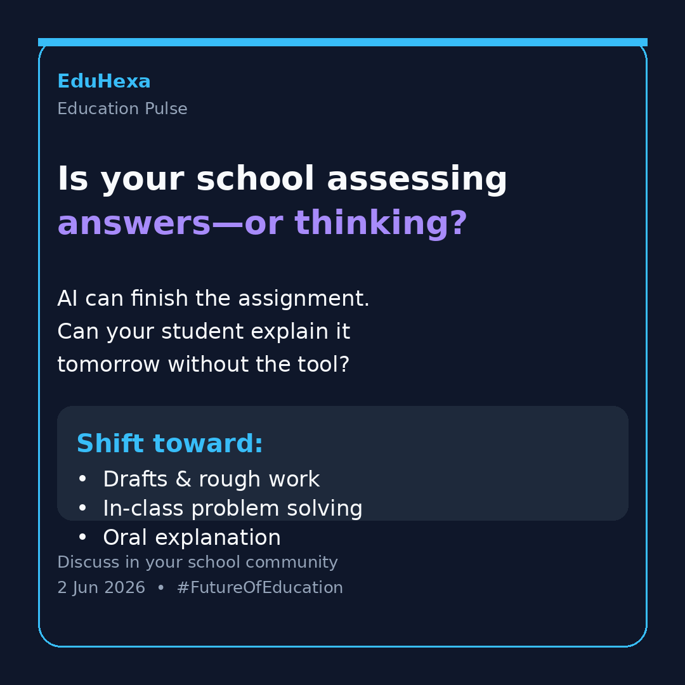

# EduHexa Education Community Insights

**Date:** 2026-06-02  
**Scan window:** ~26 May – 2 June 2026  
**Sources:** Exa web search across Reddit-adjacent education discourse (r/Teachers, r/education, r/edtech, r/Professors, r/Indian_Academia, r/CBSE, r/JEENEETards, r/IndianTeenagers, r/Parenting, r/college) plus India-focused education news tied to those communities.

> Ideas below are synthesized and rewritten. No Reddit post text has been copied directly.

---

## Pulse summary

This week’s conversations cluster around three pressure points: **CBSE result season trust**, **AI changing what “learning” means**, and **attention economics** for Indian exam aspirants. School leaders are being asked to fix policy, pedagogy, parent anxiety, and tech adoption at once—often without clear playbooks.

---

## Analysis

### Major concerns

- **Invisible learning vs visible output.** Educators report students who complete polished work but resist in-class practice when shortcuts are removed. The worry is not only cheating—it is whether students still believe thinking itself matters.
- **AI enforcement is emotionally expensive.** Large-scale discourse studies show detector-related threads carry more negative emotion for students than teachers. False accusations, appeals, and grade disputes are still active in 2026.
- **CBSE trust fracture.** Result-week stress is amplified by OSM/evaluation complaints: alleged answer-sheet mix-ups, large mark jumps after re-check, delayed scanned copies, and political scrutiny of the marking vendor.
- **Parent–school expectation gap.** Parents want transparency on AI use, homework load, and fairness; teachers want backup on behavior, cheating, and unrealistic demands at home.
- **Attention span as an exam variable.** JEE/NEET circles are openly debating keypad phones, Pomodoro blocks, and “environment design” over willpower—signals that digital distraction is treated as a rank risk, not a lifestyle issue.
- **EdTech reality check.** Practitioner forums highlight post-ESSER budget pressure, tool fatigue, and skepticism that new products reduce teacher workload rather than add reporting layers.

### Emotional patterns

- **Teachers:** exhausted, morally conflicted, torn between banning AI and teaching with it; frustrated when parents outsource mediation to schools.
- **Students:** result anxiety (especially Class 12), defensive about AI accusations, tactical about tools, increasingly questioning whether long exam pipelines still pay off.
- **Parents:** guilt about screens, anger about weekend homework stealing family time, fear that AI makes it harder to know if the child actually learned.
- **Institution owners:** curious about AI curriculum and analytics, cautious about reputational risk from weak implementation or opaque grading systems.

### Emerging trends

- **Process-based assessment** (drafts, in-class writes, oral defense) replacing trust in take-home final answers.
- **“Friction by design”** for competitive exam prep—basic phones, focus modes, scheduled scroll windows.
- **Hybrid coaching as default** for NEET/JEE: offline accountability + online mocks/analytics/AI doubt support.
- **Parenting shift on screens:** experts push intentional use over total bans; complete restriction is framed as creating rebound hyper-fixation.
- **Marks still open doors, skills increasingly defend careers**—especially in AI-disrupted fields.
- **Schools expanding mental-health support** around board results (helplines, counselling windows).

### Controversial opinions gaining traction

- If students believe AI will make all future decisions, schools must confront that belief—not only police tool use.
- Homework on weekends may be “anti-family”; others argue structure on Friday prevents Sunday panic.
- Re-evaluation stories fuel the view that low scores sometimes reflect process failure, not student failure.
- AI grading by teachers while banning student AI use is seen as hypocritical and erodes trust.
- Online-first board prep is gaining social proof among high scorers; offline institutes still sell discipline.

### Operational problems

- No shared AI-use ladder (prohibited / disclosed support / encouraged tutoring).
- Teachers lack time to redesign assessments and train on responsible AI.
- Evaluation systems with weak explainability create parent escalations at scale.
- LMS + app sprawl without integration increases admin load.
- Competitive exam students receive conflicting advice across coaches, apps, and social feeds.

### Future opportunities

- Publish **one-page AI rules** for students, parents, and teachers (what to outsource, what never to outsource, how learning is verified).
- Build **parent briefings** on results stress, re-evaluation rights, and healthy screen habits.
- Train teachers on **90-minute focus blocks** and retrieval practice—aligned with what top coaching voices now recommend.
- Help schools move reporting from marks-only to **competency + effort signals**.
- Position EduHexa as a calm forum for **implementation**, not tool hype.

---

## Community content

### 1. WhatsApp community discussion post 1 (text)

**Topic: CBSE results are done. The real exam is trust.**

This week, a lot of parent and student energy is not about “celebration posts.”

It is about:
- unexpected marks  
- re-evaluation stories  
- scanned copies that do not match expectations  
- stress calls to helplines  

Even when procedures exist, **emotional reassurance is missing**.

For school leaders, the lesson is not only “communicate results faster.”

It is: **how do we help families interpret results without panic or shame?**

Three practical questions for your team:
1. Do parents know exactly what re-check / verification options mean?  
2. Do class teachers have a script for “bad result” conversations?  
3. Are we tracking students who go quiet after results—not only those who complain?

Share what your school did this result season that actually reduced parent anxiety.

---

### 2. WhatsApp community discussion post 2 (image)

**Visual post theme:** *“Is your school assessing answers—or thinking?”*

**On-image copy (short):**
> AI can finish the assignment.  
> Can your student explain it tomorrow?

**Caption for WhatsApp:**
Many classrooms are shifting homework in-class because take-home work no longer shows learning.

The bigger shift for 2026:
- drafts over final polish  
- oral explanation over silent submission  
- in-class problem solving over “completed at home”  

**Poll in chat:** Where is your school today?  
A) Still mostly final-answer assessment  
B) Mix of process + product  
C) Redesigning assessments this year  
D) No clear policy yet  

---

### 3. Engaging poll

**Poll: What should Indian schools prioritize in the next 90 days?**

A. Clear AI-use policy (student + parent version)  
B. Assessment redesign (process evidence)  
C. Parent communication on results & mental health  
D. Teacher training on AI + classroom focus  
E. Career guidance beyond marks (skills + pathways)  

**Follow-up:** Pick one option—what is the first concrete step you would take on Monday?

---

### 4. Thought-leadership insight

The most dangerous assumption in 2026 is that students are “against learning.”

Many are not. They are optimizing for **fast outputs in systems that still reward outputs**.

When a ninth grader says future decisions will be made by AI, that is not only a discipline issue. It is a **philosophy-of-education** issue.

Schools that win trust will:
- explain *why* thinking still matters in an AI world  
- show careers where judgment beats generation  
- assess in ways where shortcuts do not replace understanding  

Policy without pedagogy will fail. Pedagogy without parent alignment will stall.

---

### 5. Future of education observation

The next classroom differentiator may be **boredom tolerance**.

Short-form stimulation trains the brain for quick rewards. Competitive exams and deep subjects require the opposite: sustained focus, error recovery, and delayed gratification.

Interesting signal from aspirant communities: some high performers are choosing **low-friction devices** not because they reject technology—but because they are designing their environment.

Future-ready schools may teach attention like they teach literacy: explicitly, progressively, and without shame.

---

### 6. LinkedIn post idea for EduHexa

**Theme:** Board results expose a systems problem—not just a student problem

**Draft post:**

CBSE Class 12 results always bring two stories.

One family posts relief and pride.  
Another student disappears into shame, family conflict, or endless re-check anxiety.

Both are real.

This year, public conversation also focused on evaluation trust—scanned copies, marking discrepancies, and whether students should pay to see their own work.

For school leaders and edupreneurs, the takeaway is uncomfortable but important:

**We cannot ask students to take ownership of learning while the system around them feels opaque.**

Three questions worth discussing with your team:
1. How do we communicate result options without legal jargon?  
2. How do we support students emotionally—not only academically—during result week?  
3. How do we redesign assessments so marks reflect thinking, not just completion?

EduHexa is building conversations for leaders who want practical answers, not panic headlines.

**Closing question:** What is one policy or practice you would standardize before next board season?

---

## Notion page payload

> **Notion MCP status:** `needsAuth` in this environment. Paste the blocks below after connecting Notion in Cursor, or import this file. Attach `eduhexa-whatsapp-image-post-2026-06-02.png` to the image section.

### Page title
`EduHexa Education Pulse — 2 Jun 2026`

### Page properties (suggested)
| Property | Value |
|----------|-------|
| Date | 2026-06-02 |
| Type | Weekly pulse |
| Audience | School leaders, educators, institution owners |
| Region focus | India + global education discourse |

### Notion blocks (copy-ready)

**Callout — Summary**  
Week dominated by CBSE result trust issues, AI-era assessment redesign, and attention/focus strategies in JEE-NEET communities.

**Heading 2 — Key themes**  
- CBSE results & evaluation trust  
- AI: cognitive outsourcing vs process assessment  
- Parent expectations: screens, homework, fairness  
- Teacher workload & edtech fatigue  
- Marks vs skills & career anxiety  

**Heading 2 — WhatsApp Post 1 (text)**  
[Insert "WhatsApp community discussion post 1" section above]

**Heading 2 — WhatsApp Post 2 (image)**  
  
[Insert caption from post 2]

**Heading 2 — Poll**  
[Insert poll section]

**Heading 2 — Thought leadership**  
[Insert section 4]

**Heading 2 — Future of education**  
[Insert section 5]

**Heading 2 — LinkedIn draft**  
[Insert section 6]

**Divider**

**Callout — Action for EduHexa team**  
Schedule community poll in WhatsApp; publish image post; adapt LinkedIn draft for founder/company page.

---

## Assets

| File | Purpose |
|------|---------|
| `eduhexa-education-community-insights-2026-06-02.md` | Full report + Notion blocks |
| `eduhexa-whatsapp-image-post-2026-06-02.png` | WhatsApp image post #2 |
