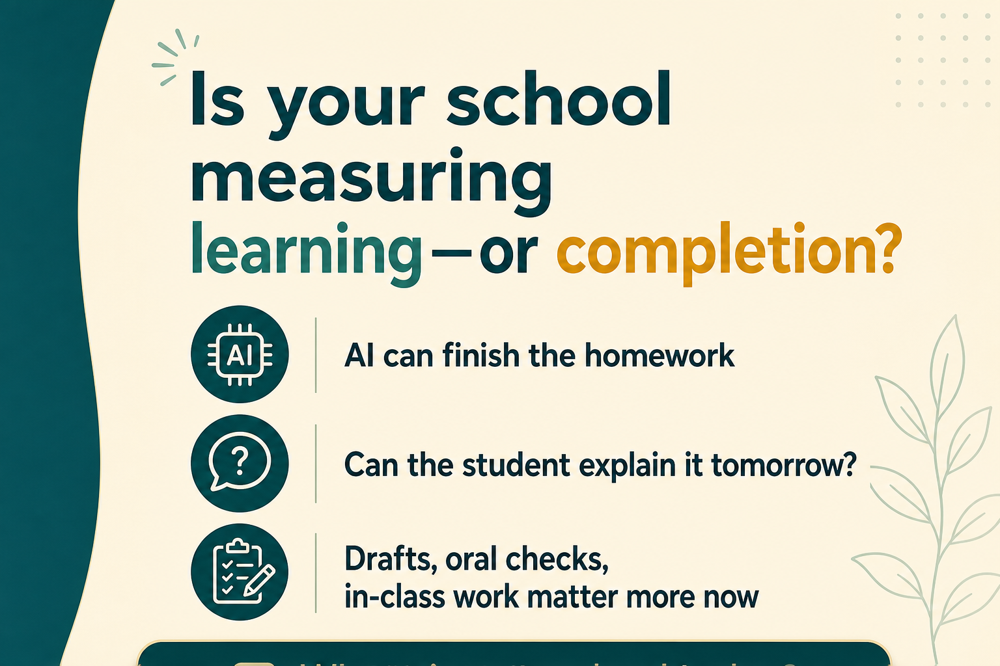

# EduHexa Education Community Insights

**Date:** 2026-06-07  
**Scan window:** ~31 May – 7 June 2026  
**Sources:** Exa web search across Reddit-adjacent education discourse (r/Teachers, r/education, r/edtech, r/Professors, r/Indian_Academia, r/CBSE, r/JEENEETards, r/IndianTeenagers, r/Parenting, r/college) plus India-focused education news tied to those communities.

> Ideas below are synthesized and rewritten. No Reddit post text has been copied directly.

---

## Pulse summary

This week’s conversations are dominated by **trust fatigue**—between students and teachers over AI, between families and boards over marks, and between parents and schools over screens. A fresh NPR/Ipsos poll shows nearly 3-in-4 K-12 teachers believe AI will reshape education more than the internet did, yet about half report little or no school guidance. In India, CBSE re-evaluation portal glitches are colliding with JEE counselling and NEET re-conduct stress. The emotional tone is less “AI curiosity” and more “who is accountable when the system wobbles?”

---

## Analysis

### Major concerns

- **AI is eroding classroom trust faster than policy is being written.** Nearly 60% of polled US teachers say AI weakens student–teacher trust; many are moving to in-class and handwritten work. Reddit discourse studies show adversarial integrity threads draw 2–4× more engagement than constructive integration talk.
- **Cognitive dependency, not just cheating.** K-12 educators worry students skip the “productive struggle”—reading, drafting, debugging—and submit outputs they cannot explain. Some report large cohorts using AI on reflective prompts without even reading the answers.
- **“Teacher or cop” burnout.** Faculty describe integrity enforcement consuming mental bandwidth, with weak institutional backing when cases escalate. The feeling: educators signed up to teach, not to run surveillance.
- **CBSE result-season operational stress.** Students report re-evaluation portal failures, session timeouts, blurred scanned copies, and uncertainty while JoSAA counselling runs. NEET re-conduct (21 June) is landing on students already drained from board + first NEET cycle.
- **Evaluation fairness as a parent flashpoint.** Viral student stories contrast celebration at home with punishment after modest scores; OSM scepticism remains high even after board assurances.
- **Attention span treated as an academic risk.** International teacher surveys and classroom reporting show shorter focus, more “brain breaks,” micro-lessons, and cellphone bans—but also parent revolts against passive school screen time (YouTube at snack time, gamified apps replacing teachers).
- **School–coaching misalignment in India.** A central panel continues to push coaching caps (2–3 hours/day), syllabus alignment with JEE/NEET, dummy-school crackdowns, and career counselling from Class 8—signalling that formal schooling still loses to the parallel coaching economy.
- **Career ladder anxiety.** College and early-career communities debate whether CS/engineering degrees still guarantee entry-level roles; AI displacement fear is showing up as grief and identity loss, not only unemployment statistics.

### Emotional patterns

- **Teachers:** morally tired, suspicious of take-home work, quietly shifting to in-class assessment; some using AI for lesson planning while resenting student misuse; feeling unsupported on integrity cases.
- **Students:** defensive about false AI flags; demotivated after exam-system shocks (paper leaks, centre conditions, portal glitches); tactical about tools; questioning whether years of coaching still map to stable careers.
- **Parents:** angry when school screens undermine home limits; anxious about marks, admissions eligibility, and “lost years” in coaching; split between pushing harder and fearing burnout.
- **Institution owners:** pressured to adopt AI curriculum and analytics while managing reputational risk from grading controversies, parent WhatsApp groups, and teacher retention.

### Emerging trends

- **Process evidence over polished products:** drafts, oral explanation, in-class writes, version histories, and “explain it tomorrow” checks.
- **Assessment moving back into the room:** homework downgraded; supervised labs and timed tasks up.
- **Screen-time backlash in schools:** LAUSD-scale limits, parent petitions, district audits of edtech spend—questioning whether devices improved learning or just replaced teaching.
- **AI literacy as curriculum, not only compliance:** critique AI outputs, compare human vs generated work, disclose prompts—moving from ban-only to framework-based use.
- **India policy drift toward “school as coaching hub”:** JEE/NEET prep inside CBSE Classes 9–10, hybrid board+entrance weighting, regulated coaching disclosures.
- **Career conversations earlier and messier:** students weighing degrees against skills, portfolios, and AI-augmented roles; anxiety when the old ladder (degree → junior role → seniority) looks broken.
- **Mental-health infrastructure around exams:** CBSE helpline extensions, post-result counselling—reactive support that highlights how thin school-side proactive guidance remains.

### Controversial opinions gaining traction

- AI bans may widen inequality: guided students learn responsible use; others hide misuse.
- If teachers use AI to grade while banning student AI, trust collapses.
- Low board marks sometimes reflect process/system failure, not student ability—re-evaluation stories fuel this view.
- “Let the internet raise the kids” narratives blame parents, but many families lack time/support—not indifference.
- MBBS vs B.Tech “safety” debates oversimplify; both paths now carry uncertainty, but exam-coaching culture still treats rank as destiny.
- EdTech adoption without pedagogy redesign is “automating the old factory model,” not innovating.

### Operational problems

- Few schools have clear, tiered AI policies (prohibited / disclosed support / encouraged tutoring).
- Detector tools create false positives; appeals workload lands on teachers.
- Tool sprawl and LMS friction increase admin load while ~53% of US teachers report burnout.
- CBSE digital evaluation + counselling timelines create eligibility edge cases (75% / top-20 percentile rules vs pending re-evaluation).
- Schools lack structured career counselling; coaching centres fill the vacuum with analytics and test rhythm.
- Parent communication is crisis-driven (results week) rather than continuous on AI, screens, and assessment design.

### Future opportunities

- Publish **one-page AI rules** for students, parents, and teachers—what may be outsourced, what may not, how learning is verified.
- Run **parent briefings** on results stress, re-evaluation rights, and intentional screen use (quality over quantity).
- Train teachers on **assessment redesign** and restorative integrity conversations—not only detection.
- Help schools articulate **marks + skills** pathways without turning skills into another marks race.
- Support leaders on **India-specific implementation**: aligning classroom rigour with entrance-exam reality without cloning coaching-centre toxicity.
- Position EduHexa as a **calm implementation voice** for the AI-and-attention era—not another tool pitch.

---

## Community content

### 1. WhatsApp community discussion post 1 (text)

**Topic: Teachers are not anti-AI. They are anti-invisible learning.**

A lot of classroom frustration this week is not about students “being lazy.”

It is about a new question:

If the answer looks perfect, how do we know thinking happened?

Educators are reporting:
- take-home work that sounds nothing like the student  
- reflective answers that were never read  
- trust breaking down faster than policies are written  

Many are responding practically—in-class writing, oral checks, drafts, smaller stakes on homework.

But that creates another pressure: **teachers now redesign assessments while also teaching, counselling, and answering parents.**

Question for school leaders and institution owners:

Is your school solving AI with rules—or with learning design?

Where are you today?
1. Mostly banning / detecting  
2. Building process-based assessment  
3. Training teachers on responsible AI use  
4. Still figuring it out  

What is working in your school without turning teachers into full-time investigators?

---

### 2. WhatsApp community discussion post 2 (image)

**Visual post theme:** *“Is your school measuring learning—or completion?”*

**On-image copy (short):**
> AI can finish the homework.  
> Can the student explain it tomorrow?

**Caption for WhatsApp:**
Take-home polish no longer proves understanding.

More schools are shifting toward:
- rough drafts and in-class explanation  
- supervised problem-solving  
- “show your thinking” over final neatness  

This is not anti-technology. It is pro-verification.

**Quick check for your team:** If AI disappeared tomorrow, would your current assessments still measure real learning?

**Image asset:** `eduhexa-whatsapp-image-post-2026-06-07.png`

**Poll in chat:** Where is your school today?  
A) Still mostly final-answer assessment  
B) Mix of process + product  
C) Redesigning assessments this year  
D) No clear policy yet  

---

### 3. Engaging poll

**Poll: What is the biggest trust gap in your school community right now?**

A. Students using AI without understanding the work  
B. Parents not knowing what AI use is allowed  
C. Teachers not getting time/training to redesign assessments  
D. Board/exam processes feeling opaque or unfair  
E. Too much screen time—at home and in school  

**Follow-up:** If you could fix only one this term, which would reduce the most daily friction?

---

### 4. Thought-leadership insight

The AI debate in schools is often framed as integrity.

The deeper issue is **epistemology**: how do we know someone learned?

Marks reward outputs. Parents reward ranks. Apps reward speed.

When outputs become cheap, schools must reward **evidence of thinking**—questions asked, mistakes corrected, explanations given, connections made.

Indian institutions face a double bind: board culture still centres marks, while students hear that skills and judgment will define careers.

Leaders who navigate this well will not pick one side. They will build bridges:

- marks for access  
- skills for adaptability  
- process visibility for trust  

Without all three, anxiety fills the gap.

---

### 5. Future of education observation

The next competitive advantage in education may be **attention stewardship**.

Not “no screens”—but intentional environments where deep work is possible.

Globally, schools are reversing pandemic-era device defaults. In India, aspirant communities already treat distraction as a rank risk.

Future-ready schools may teach focus the way they teach formulas: with practice, scaffolding, and honesty about boredom.

The institution that helps students sustain 45–90 minutes of real thinking—without shame or constant stimulation—may matter more than the one with the flashiest AI dashboard.

---

### 6. LinkedIn post idea for EduHexa

**Theme:** AI did not break education. It exposed what we were already measuring badly.

**Draft post:**

Something shifted in teacher conversations this month.

It is no longer only “students are cheating with ChatGPT.”

It is: “I cannot tell if learning happened.”

Surveys show most K-12 teachers see AI as bigger than the internet for education—and most still lack clear school guidance.

In India, the same week brought a different trust crisis: re-evaluation portals, counselling deadlines, and students caught between board marks and entrance exams.

Different problems. Same root:

**When systems reward completion, shortcuts will always arrive—first calculators, then search, now AI.**

Schools that adapt will do three unglamorous things well:

1. Define what students may use AI for—and what they must do themselves  
2. Redesign assessments so thinking is visible, not only submitted  
3. Talk to parents before panic season, not during it  

EduHexa is hosting these conversations for school leaders who want practical clarity, not hype cycles.

**Closing question:** What is one assessment practice you would change before the next exam cycle?

---

## Notion page payload

> **Notion MCP status:** `needsAuth` in this cloud agent environment (interactive auth requires Cursor desktop IDE). Blocks below are ready to paste into Notion manually, or re-run after authenticating the Notion MCP integration.

### Page title
`EduHexa Education Pulse — 7 Jun 2026`

### Page properties (suggested)
| Property | Value |
|----------|-------|
| Date | 2026-06-07 |
| Type | Weekly pulse |
| Audience | School leaders, educators, institution owners |
| Region focus | India + global education discourse |

### Notion blocks (copy-ready)

**Callout — Summary**  
Week dominated by AI-trust erosion in classrooms, CBSE re-evaluation/counselling stress, screen-time backlash in schools, and career-anxiety discourse in college communities.

**Heading 2 — Key themes**  
- AI: invisible learning vs visible process  
- Teacher integrity burden & policy gaps  
- CBSE OSM / re-evaluation portal stress + NEET re-conduct  
- Attention span & school screen-time revolt  
- Marks vs skills & broken career ladders  
- Coaching-school misalignment in India  

**Heading 2 — WhatsApp Post 1 (text)**  
[Insert "WhatsApp community discussion post 1" section above]

**Heading 2 — WhatsApp Post 2 (image)**  
  
[Insert caption from post 2]

**Heading 2 — Poll**  
[Insert poll section]

**Heading 2 — Thought leadership**  
[Insert section 4]

**Heading 2 — Future of education**  
[Insert section 5]

**Heading 2 — LinkedIn draft**  
[Insert section 6]

**Divider**

**Callout — Action for EduHexa team**  
Schedule community poll in WhatsApp; publish image post; adapt LinkedIn draft for founder/company page.

---

## Assets

| Asset | Path |
|-------|------|
| Insights markdown | `eduhexa-education-community-insights-2026-06-07.md` |
| WhatsApp image post | `eduhexa-whatsapp-image-post-2026-06-07.png` |
